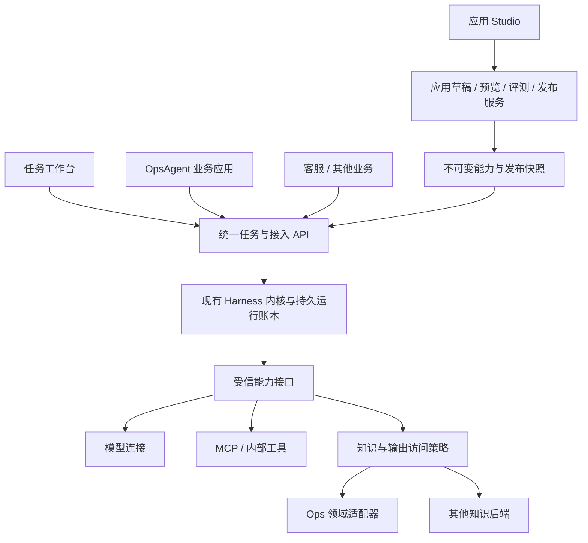

# Agent 中台产品重设计提案

日期：2026-09-18。状态：**产品方向已由用户批准，产品层重做及第四阶段 4A–4D 已实现。实际交付、验收与边界见 [实施记录](phase4-implementation.md)。**

本轮阅读了 DeepSeek Harness、腾讯云 Octop、Dify、Coze Studio、LangGraph / LangSmith 的官方仓库与文档，对照本项目代码与已有页面。没有安装或完整实测这些外部产品，不将厂商说明视作独立验收。DeepSeek Chat 页面停在登录页；研究依据是 DeepSeek 官方 Harness 仓库与文档，未在聊天网页内完成联网问答。

## 1. 结论

建议把产品定位改为：**面向多个业务的 Agent 构建、运行与交付平台**。构建者从应用目标出发，组合获批能力，立即体验、调试、评测，再发布给业务使用；业务使用者看到任务、人工请求与结果；管理员处理连接、授权、运行环境和治理。

当前系统更准确的定位是“可靠执行内核 + 资源管理控制台”。执行底座已经有价值，但产品层把实现细节当作了用户工作方式。原第四阶段继续增加模型、知识与工具管理页，不能充分解决这个问题。

建议保留 Java 17 / MySQL 执行底座，先完成产品层重设计与平台服务解耦，再深化公共能力。OpsAgent 成为平台的一个调用方和插件来源，客服和研究助手与它平级。

这不是更换配色或菜单名称。至少要改变首个应用的创建流程、草稿试运行方式、业务插件边界和质量反馈路径。

## 2. 当前问题：哪些是观感，哪些是真实耦合

| 已核实事实 | 用户遇到的问题 | 调整方向 |
|---|---|---|
| “Agent 工作台”直接复用 CatalogList；首页引导先建基础资源，再组合发布 | 工作台实际仍是资源 CRUD，用户先学内部对象 | 应用成为产品入口，底层资源由应用编译与发布流程管理 |
| 首个 Agent 要引用已发布 Workflow、RunPolicy、ToolPolicy，输入输出常用 JSON Schema | 创建助手前要先建多张表，容易在页面间跳转 | 模板提供默认配置；普通输入由表单生成，专家可展开原始配置 |
| 草稿编辑与真实运行分离；运行必须选择已发布 release | 改一句指令也不能当场看到结果 | Studio 同页编辑与预览；后台固定预览快照，不要求先对外发布 |
| 现有回归主要填冻结模型、工具与预期参数 JSON | 能验证执行契约，但不等于能比较回答质量 | 契约回归保留；另建样本、人工/规则评分和版本实验 |
| 登录文案、默认项目突出 OpsAgent；启动时固定 Ops 身份实现 | 用户容易认为平台是 Ops 子系统 | 中立工作空间入口；已有身份作为可配置适配器 |
| 检索类型和受保护输出存在 Ops 特判 | 接第二种知识源需要继续改平台服务 | 通用检索能力、数据来源追踪、领域输出访问策略 |

本地代码证据：

- `platform-console/src/App.tsx:139,261,378,495,714,837`：导航、Agent 视图、默认项目和身份文案。
- `platform-console/src/SpecEditor.tsx:85,279,295,845`：发布依赖、Schema 与冻结回归表单。
- `platform-console/src/Catalog.tsx:515`、`platform-console/src/Runs.tsx:299,336`：编辑和运行分离。
- `harness-platform-service/src/main/java/io/github/djyking/harness/platform/PlatformApplication.java:56`：固定 OpsAgentIdentityProvider。
- 同目录 `IdentityProvider.java:40`、`OpsAgentIdentityProvider.java:87`：身份接口混入业务输出授权。
- 同目录 `CatalogValidator.java:496`、`PlatformService.java:228`：检索类型及特定 Ops 输出链路判断。

同时，core、storage、capabilities、通用 adapters 与薄 client 已独立于 Ops 业务；内核已有 AgentLoop。不能把前端不好用推导成“所有底层工作都是复制”或“没有真正 Agent”。

## 3. 外部产品：分别学什么

| 产品与官方来源 | 已查到的设计 | 本项目借鉴 | 不直接照搬 |
|---|---|---|---|
| [DeepSeek Harness](https://github.com/deepseek-ai/deepseek-harness) | everything-is-a-plugin；模型、工具、循环、会话日志与 UI 可组合；工作区/会话入口；Web、SDK、headless 等形态 | 能力接口、生命周期、任务上下文；同一内核支持多个产品入口 | developer preview；不能把任意进程内插件当作多用户隔离边界；不因此全盘改写为 TypeScript |
| [腾讯云 Octop](https://github.com/TencentCloud/Octop) | 任务/聊天、专家模板、连接器、技能、知识、记忆和多渠道组合；配置与使用分组 | 先做事再配置；从模板装配能力；任务页呈现过程与结果 | 主定位家庭/小团队；单进程部署取舍、MBTI、远程桌面不作为本中台必需项 |
| [Dify](https://docs.dify.ai/en/self-host/use-dify/getting-started/introduction) | 应用编排、知识、调试、发布、监控；草稿/发布区分 | 应用工作台、同页预览、调试与发布接入闭环 | 许可附加条件；完整视觉/代码不直接复制；新版 Agent beta 不作为生产可靠性证明 |
| [Coze Studio](https://github.com/coze-dev/coze-studio) | Agent/App 与资源分层，模板、可视工作流、API/SDK | 创建应用优先；共享能力独立；接入说明成为产品功能 | Go/Eino 与 Java 双引擎不能自动共享审批和运行账本；商业版能力不能都归于开源版 |
| [LangGraph / LangSmith Studio](https://docs.langchain.com/langsmith/studio) | 有状态执行框架与 Studio/观测平台分层；Chat/Graph 视图；失败进入评测集 | 使用视图和工程视图区分；运行→样本→评测→发布闭环 | LangGraph/SDK 开源不代表 LangSmith 平台开源；自部署 Enterprise 的条件需单独评估 |

需要保留的事实边界：Octop 的官方后台委托文档明确 inbox 为内存态，重启会丢失进行中的后台工作；README 的总体 restart-safe 描述不能覆盖这一细节。它的 UI 与能力装配值得学习，不应拿来替代已验证的持久执行语义。[依据](https://github.com/TencentCloud/Octop/blob/main/docs/agent-delegation.md)

Octop 导航中的 Tasks 当前主要对应定时任务管理，不等同于本平台的 Run 列表；DeepSeek 的会话内 allow-once/reject 交互也不能直接推断为跨角色的持久审批。这些入口只作为产品组织参考，执行语义单独核对。

研究快照：DeepSeek `ddefc45fbc7f8e46dd73185e68295696d1297887`；Octop `ae65fe4e26854d2eaf751cee89341ec5d71569f0`；Dify `c4dbc4c830e98db21be9dd89321b58607a62df18`；Coze `fefb05ff27be1da939612fbf9faf5db62583b8ae`；LangGraph `c81c13533ee48c1ae0ef2de314737ef0c455f2be`。文档站为查询日页面，更新速度可能不同于仓库快照。

## 4. 产品结构：构建、使用与治理

默认进入“构建应用”，面向开发者和业务构建者；普通业务用户进入“使用助手”。治理按权限开放。三者共享应用与任务数据，不复制执行器。

```text
工作空间：按团队/项目组织，登录后展示当前有权进入的空间
├─ 构建应用
│  ├─ 应用与模板（默认入口）
│  ├─ 应用 Studio：构建 / 评测 / 发布与接入 / 运行与反馈
│  └─ 共享能力：模型、连接器与工具、知识、可复用指令/流程
├─ 使用助手
│  ├─ 已发布助手
│  ├─ 任务与会话
│  └─ 待我处理、结果与文件
└─ 平台管理
   ├─ 身份接入、工作空间授权
   ├─ 受信连接、凭据与执行环境
   └─ 配额、发布策略、审计、异常处理
```

工作空间在首版直接映射现有项目隔离域，避免再造一层未经定义的 tenant。外部接入应用身份、平台 AI 应用、运行实例分开命名，不能把目前用于认证的 applicationId 直接改名成新 AI 应用 ID。

### 4.1 应用首页

优先展示“创建应用”“从模板开始”及最近编辑应用；每项只显示用途、负责人、草稿/已发布状态和入口。没有数据时提供真实空状态，不展示虚构调用量或成功率。

首批模板：知识问答助手、工具任务助手、结构化流程。模板必须能生成可执行默认策略，不能只是填充名称的空壳。知识问答与工具任务用于证明差异性；Ops 只读接入保留为兼容回归，不作为所有模板的中心。

### 4.2 应用 Studio

- 左侧：目标与指令、模型、知识、工具、输入输出、运行边界。
- 右侧：立即体验。支持对话或按输入 Schema 自动生成表单；工具活动、引用和人工请求可展开。
- 高级模式：工作流图与节点参数；只提供当前内核真实支持的节点与控制语义。
- 调试信息：配置版本、步骤输入输出、调用记录和错误原因在当前应用上下文展开；默认不要求用户理解 invocation、ETag 或 release digest。
- 评测：从试用/历史运行加入样例；对候选版本与基线比较，区分正确性、引用、工具行为、延迟和用量。冻结回放与真实调用单独标记。
- 发布与接入：显示确切版本、测试入口、API/Java SDK 示例和默认版本；发布目标先限 Web 体验与 API，不预先承诺所有 IM 渠道。

普通路径为：**选模板 → 写目标 → 选择可用能力 → 试用 → 看结果并改进 → 评测 → 发布 → 接入。** 第一次试用不要求先手工发布八种资源。

步骤输入输出属于受控调试产物，不写入当前仅含元数据的公共诊断 trace。单独定义脱敏、当前数据权限与保留期；不采集凭据。无法安全保存时只展示元数据。最终答案无权查看的内容，也不能从调试或评测页面绕道读取。

### 4.3 任务工作台

面向使用者展示目标、当前状态、真实执行活动、人工请求和结果；有文件任务时展示文件及来源。模型没有产生计划时不伪造“思考步骤”；工具记录与用户可见说明不是隐藏思维链。

任务与会话不是 Run 的简单改名：一个会话可包含多次提交；每次提交绑定一个不可变执行快照与 Run；等待审批恢复继续原 Run。新建任务、继续原任务和重新执行必须有不同语义。

结果文件使用独立 Artifact 对象，记录来源 Run、内容类型、存储引用和访问策略。知识源数据、引用、模型生成文本、文件、长期记忆分别管理；不把所有内容塞进“知识库”。

长期记忆初版默认关闭。后续如开放，须支持用户查看、修正、删除和来源追踪，项目范围与用户范围明确，不能未经同意自动沉淀业务秘密。

## 5. 技术边界：保留内核，新增应用层，解耦 Ops



### 5.1 应用层与现有资源兼容

新增 `AiApplication`、`AppDraft`、`PreviewSnapshot`、`EvaluationSet/Experiment` 等产品对象。`AppDraft` 保存用户可理解的声明，服务端编译为现有资源及固定依赖快照；首版可以扩展现有 Agent 元数据，而不是立即复制一套版本系统。

应用草稿带 revision；编译成功后一次性形成完整依赖清单。预览使用明确标记的不可变快照，进入相同鉴权、预算、工具策略、审批和账本；不影响默认发布，不绕过受信连接，不直接执行可变草稿。

预览不对外公开。清理只针对不再引用的草稿缓存；运行、审批、外部副作用证据与必要快照遵循审计保留，不能按“临时预览”随意删除。正式发布前显示变更、评测状态和范围，仍采用现有事务与幂等机制。

已有发布与历史 Run 原样保留；旧八类资源界面降为高级入口。迁移已有 Agent 到应用视图时导入依赖引用，不复制执行记录、不触发新调用。

### 5.2 能力接口与管理员职责

先做经过部署审核的 SPI/adapter：模型、工具连接、检索、数据访问策略、身份。插件登记包括能力、契约版本、凭据引用、项目许可与诊断。

管理员完成连接创建、凭据绑定、目标验证与测试；构建者只选择已获准的连接和工具。新发现的 MCP 工具必须经过授权和契约审核后才能使用。插件生命周期展示配置、连接、可用性及错误，不把“保存成功”当成“能运行”。

不在本轮引入任意 npm/Python 代码热安装，也不因为借鉴 DeepSeek 的插件理念而放弃网络和进程边界。沙箱/文件任务按独立切片建设，发布快照固定能力版本。

### 5.3 身份和业务数据解耦

分开身份验证、项目授权/执行委托、领域数据访问三类职责。已有 Ops 身份适配继续使用；新增可配置选择点，以标准 OIDC 或受控测试身份验证可替换性，不立即另建密码账户库。

知识不强制搬入平台，也不强制永远由 Ops 托管。平台拥有知识集合目录和检索契约；内容可以来自 Ops 知识服务或独立后端。连接创建者不能把受保护数据标记为公开。

受保护模型答案需要来源追踪与访问策略：记录输入数据来源与版本；读取时重新检查当前权限；首版可采用保守整份输出策略，任何必需来源失权就隐藏全文。无法证明来源/权限的输出继续拒绝开放。不能简单移除当前 Ops 特判，否则会扩大数据访问。

脱离 Ops 的验收必须验证：**关闭 Ops 适配器后，通用平台仍可完成登录、创建应用、试运行、评测和发布；启用后既有领域 ACL 与撤权行为继续成立。**

### 5.4 一个执行结果只能有一个权威账本

保留已有 Run、调用意图、审批、UNKNOWN 和 SQL 恢复语义。外部平台、外部 Agent runtime 将来若接入，先声明支持能力，明确执行归属与状态映射，不同步维护两套可独立重试的权威账本。

调试回放默认使用录制结果；真实重新调用是新请求且显式计入用量。不能通过节点重跑、时间旅行、模型降级等功能重放未知写操作。真实模型 UNKNOWN 的诊断粒度补齐，但不根据模糊异常将原调用改判成功。

## 6. 第四阶段重排

以下切片已批准，实施顺序和可验收边界以 [第四阶段实施记录](phase4-implementation.md) 为准。

| 切片 | 交付内容 | 完成门槛 |
|---|---|---|
| 4A 产品验证 | 本提案与可点击原型；走查创建、体验、发布、审批三条路径；比较自研与成熟平台 | 用户能从任务和应用角度理解平台，不需先理解八类资源；确定继续自研还是采用现成产品 |
| 4B 中立 Studio 纵向切片 | 应用声明、模板、固定预览快照、同页体验、API 发布；可配置身份/知识适配，优先清除阻断通用应用的 Ops 特判 | 至少知识助手和一种非 Ops 工具/结构化任务使用同一套页面与 API；创建、预览、发布无需手写 JSON 和修改平台代码；关闭 Ops 仍可运行 |
| 4C 能力与任务完善 | 模型/知识/MCP 连接管理、凭据与授权界面、通用来源策略；任务与产物工作台；按实际需求补文件任务执行边界 | 管理员能在受控流程中接新连接；构建者无须改部署 JSON；资源撤销影响调用与输出；产物可审计；Ops 兼容回归通过 |
| 4D 质量与交付闭环 | 失败转样本、冻结数据集、多版本/多模型实验、质量门槛、发布比较与回退 | 两类应用的变更能以证据判断是否更好；发布不改变运行中任务；UNKNOWN 与写入不会被评测或重试掩盖 |

4B 内必须有最小评测/发布检查；4D 再把它做成完整运营能力，不能让前面切片成为无质量门槛的发布捷径。

4B 的最小门槛具体包括：模板契约回归、至少一组固定输入/预期样例、候选与基线并排结果，以及人工确认发布。评测工具默认使用冻结结果或隔离测试连接；真实写操作仍遵循普通审批与调用账本，不能按“评测”批量重放。

4B 的通用知识助手先使用公开或合成知识；原 Ops 受保护输出保持现有限制。4C 完成通用来源与访问策略之后，才开放受保护资料的模型综合回答。如果选择在 4B 使用真实受保护资料，最小来源策略必须同步前移。这一依赖不能通过暂时关闭 ACL 来解决。

建议的产品验收脚本：

1. 已有获批模型后，新构建者从空项目创建一个知识助手，选择示例知识，修改指令并试用，不接触资源版本号或 JSON；以 10 分钟作为待验证目标，实际记录用时和卡点。
2. 同一个 Studio 创建另一个领域的工具/表单任务；不能在平台通用代码中增加该业务名字或专用分支。
3. 从失败运行建立样例，改一次 Prompt，比较候选和基线；展示真实结果，人工评分与自动评分分开。
4. 发布后从通用 Web 体验与业务 API 调用同一版本；切换默认后，已有等待任务保持旧快照。
5. 审批者从任务收到明确人工请求，处理后回到原任务；结果未知时展示证据要求，不提供模糊“一键重试”。
6. 关闭 Ops 插件完成通用路径；重新启用后验证原检索、权限拒绝与旧 Run 行为无退化。

保留阶段五的生产容量、故障/SLO/告警和阶段六的正式业务迁移门槛。第四阶段改善产品能力，不自动完成生产切流。

## 7. 是否继续自研：必须保留的备选

| 方案 | 优势 | 代价 / 适用条件 |
|---|---|---|
| A. 保留 Harness，自研 Studio（推荐） | 原有可靠执行与业务适配可连续演进；Java 技术栈和治理边界可控 | 要长期投入产品、连接与评测；只有需要公共执行/治理差异化时值得 |
| B. 直接采用 Coze Studio 或 Dify | 更快获得成熟应用构建体验，生态较完整 | 引入新栈/运行语义；当前审批和 UNKNOWN 保证必须重新验证；Dify 许可另有条件 |
| C. 将 Octop 作为统一个人/团队助手 | 任务入口、多渠道和个人能力丰富 | 目标会变成助手产品；其部署/恢复设计和部分未公开运行库须独立评估，不能当企业中台直接替换 |

推荐 A 的理由是用户原目标包括多业务公共执行与治理，且已有相关资产；不是“已经投入所以不能换”。4B 做一个完整纵向切片后设置退出评审：若创建和调试体验仍没有明显改善，应重新比较 B，而不是持续堆更多配置页。

许可核实截至查询日：DeepSeek、Octop 为 MIT；Coze Studio 为 Apache 2.0；Dify 为 Apache 2.0 基础上附加条件，多租户使用和前端标识有限制；LangGraph/SDK 的 MIT 不覆盖 LangSmith 整个平台。直接采用/分发前还需核对所选版本及依赖，研究借鉴通用原则不等于复制代码和品牌。

## 8. 这次需要确认的方向

1. **产品主目标**：推荐“Agent 应用构建与运行平台”，附带通用体验工作台；如果真正更想要 Octop 式个人/团队助手，导航、任务能力和接入优先级会不同。
2. **采用路线**：推荐先用现有内核实现一个 Studio 纵向切片，并把完整采用 Coze/Dify 作为对照和退出选项。
3. **第一个非 Ops 验收应用**：推荐“资料研究与报告助手”或“结构化资料处理任务”，验证工具和产物路径；客服知识助手作为另一条路径，避免再次只证明两个相似问答页面。

本机验收、沿用现有身份来源、独立仓库控制台、develop/ 分支及既有验证费用授权持续有效，不重新询问。用户已确认按推荐路线实现产品层；已启动第四阶段，未安装外部平台或切换生产流量。

## 9. 主要官方资料

- DeepSeek：[README](https://github.com/deepseek-ai/deepseek-harness/blob/master/README.md)、[架构](https://github.com/deepseek-ai/deepseek-harness/blob/master/docs/architecture.md)、[使用指南](https://github.com/deepseek-ai/deepseek-harness/blob/master/docs/user/guide/index.md)、[安全边界](https://github.com/deepseek-ai/deepseek-harness/blob/master/SAFETY.md)。
- Octop：[README](https://github.com/TencentCloud/Octop/blob/main/README.md)、[导航源码](https://github.com/TencentCloud/Octop/blob/main/dashboard/src/layouts/sidebarNav.tsx)、[委托语义](https://github.com/TencentCloud/Octop/blob/main/docs/agent-delegation.md)、[单进程 ADR](https://github.com/TencentCloud/Octop/blob/main/docs/adr/001-single-process-model.md)。官方 README 截图标为 v0.9.8，不能当成当前版本全界面验收。
- Dify：[产品入口](https://docs.dify.ai/en/self-host/use-dify/getting-started/introduction)、[单节点调试](https://docs.dify.ai/en/self-host/use-dify/debug/step-run)、[版本](https://docs.dify.ai/en/self-host/use-dify/build/version-control)、[新版 Agent](https://docs.dify.ai/en/self-host/use-dify/build/new-agent/overview)、[许可证](https://github.com/langgenius/dify/blob/main/LICENSE)。
- Coze Studio：[官方仓库](https://github.com/coze-dev/coze-studio)、[许可证](https://github.com/coze-dev/coze-studio/blob/main/LICENSE-APACHE)。
- LangGraph / LangSmith：[持久化](https://docs.langchain.com/oss/python/langgraph/persistence)、[Studio](https://docs.langchain.com/langsmith/studio)、[评测](https://docs.langchain.com/langsmith/evaluation)、[部署条件](https://docs.langchain.com/langsmith/platform-setup)。

本项目现状依据：[第三阶段实施记录](phase3-implementation.md)、[原阶段路线](agent-platform-roadmap.md)。历史完成记录保留；本提案为已批准的方向；具体功能状态以第四阶段实施记录和验收证据为准。
