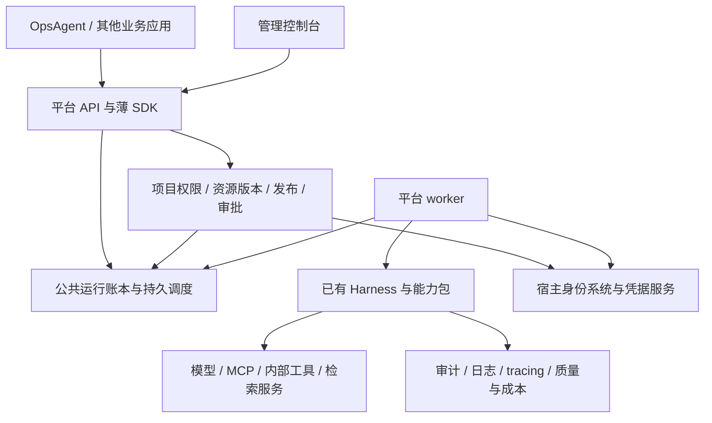

# 从 Harness 到 Agent 中台：分阶段建设方案

> 本文保留规划/历史基线；2026-09-18 阶段一、二见 [交付记录](phase12-implementation.md)，阶段三见 [实施记录](phase3-implementation.md)，本次产品重做与调整后的第四阶段见 [第四阶段交付记录](phase4-implementation.md)。本文早期“尚未实现”描述不代表最新代码状态。

日期：2026-09-15。状态：用户已确认启动阶段 1，同时设计阶段 2 API。当前交付与未完成验收项见 [阶段 1 进展](phase1-progress.md)；阶段 2 服务及后续平台功能仍按路线分阶段实施。

## 1. 结论与完成标准

建议保留当前 Harness 作为公共执行内核，在现有 `agent-ai-platform` 仓库上分 **6 个阶段**建设服务、管理和运营能力。Harness 的嵌入式 SDK 继续存在，业务可逐步改为通过平台 API 调用；中台不会取代内核，也不要求所有业务代码进入平台。

本方案按「一个组织内部、多个业务应用/项目使用的 Agent 中台」设计，暂不以对外销售的多租户 SaaS 为目标。如果以后提供外部租户服务，需要单独评估租户安全边界、合同、计费和数据部署方式。

这里的中台完成标准是：多个业务能通过统一入口，配置和发布 Agent，使用受授权的模型/Prompt/工具/知识/Workflow，提交和管理运行，完成审批与异常对账，并统一观察质量、成本和运行状况；平台具备明确的维护、升级、恢复和接入流程。

三个可独立验收的完成点：

- **阶段 3 完成：中台 MVP。** 至少两个受控接入方可以通过同一平台配置、调用、审批和查看执行。
- **阶段 5 完成：生产级中台。** 公共能力管理、质量评测、容量治理和运维保障达到约定验收要求。
- **阶段 6 完成：中台建设与业务迁移闭环。** 目标业务使用统一平台，旧执行职责退出，后续 Agent 可自助接入。

“完整”不包含所有可能的 Agent 功能。模型训练/推理集群、插件市场、SaaS 商业计费和任意用户代码沙箱，不是本路线的完成条件。

## 2. 当前起点：阶段 0 已完成

已实现五个模块：core、storage-jdbc、adapters、capabilities、examples。包含 AgentLoop、工具治理、SQL 账本、模型路由与协议适配、文件 Prompt、轻量检索、有界 Workflow、日志和 tracing。上一轮本地验证为 107 项测试通过，详情见 [验证记录](verification.md)。

阶段 0 结束时仍是嵌入式框架：没有平台服务、用户管理界面、中央资源目录、生产共享调度和部署运维闭环。阶段 1 已验证真实模型、第三方只读 MCP 和独立 MySQL；OpsAgent 真实业务接入仍待完成，详见进展记录。

## 3. 总体路线

| 阶段 | 目标 | 核心交付 | 完成时能做到什么 |
|---|---|---|---|
| 1. 真实接入与契约稳定 | 确认内核适合真实业务 | 真实服务联调、OpsAgent 接入适配、第二类场景、回归数据集、版本发布约定 | Harness 可以在实际场景受控使用 |
| 2. 集中执行服务 | 把宿主职责形成公共服务 | 异步执行 API、worker、认证/项目隔离、凭据接入、持久调度、最小配额 | 应用通过 API 运行 Agent，无需各自托管执行器 |
| 3. 配置发布与管理入口 | 形成中台 MVP | Agent/模型/Prompt/工具/Workflow 目录、版本发布、基础控制台、审批和对账页面、薄 SDK | 多个接入方共享平台，管理员可管理与追踪 |
| 4. 应用 Studio 与公共能力产品化 | 以应用构建、试用和交付组织产品 | 同页真实预览、文本知识与连接管理、任务结果、候选/基线评测与版本发布 | 构建者从模板创建应用，业务使用者通过任务获得结果 |
| 5. 生产治理与规模化 | 支撑稳定的多业务运行 | 共享配额与并发、多 worker 故障恢复、成本治理、告警、备份恢复、兼容升级 | 平台可按约定容量与服务目标投入生产 |
| 6. 业务迁移与自助接入 | 完成平台落地 | OpsAgent 分批切换、第二业务生产接入、旧职责退出、自助模板和运营流程 | 新 Agent 按平台流程交付，公共执行能力由中台统一承担 |

阶段按依赖推进，不要求功能全部串行开发。阶段 1 的真实联调期间可以设计阶段 2 的 API；阶段 3 的资源格式稳定后，阶段 4 的不同能力可并行。认证隔离、审批、备份和质量回归从早期建立，阶段 5 增强规模与保障，不是到阶段 5 才开始考虑安全和可靠性。

## 4. 各阶段工作与验收

### 阶段 1：真实接入与契约稳定

**目标：验证这套框架的业务适用性，获得后续中台设计的实际依据。**

工作包：

1. 联调一个真实模型、一个真实 MCP 测试服务及独立 MySQL 开发库。先验证只读工具，再验证明确批准的沙箱写工具，记录认证、schema 变化、超时和用量行为。
2. 为 OpsAgent 选择一条业务链路，增加业务 adapter。运维对象、工单/告警规则、目标范围和业务判断仍在 OpsAgent；adapter 将身份、工具、检索、模型输入映射到 Harness。
3. 选择第二类场景验证复用，例如研发知识助手或内部流程助理。此时可先用接近业务的验收应用；到阶段 3 验证两个实际平台调用方，到阶段 6 完成生产接入。
4. 建立回归案例：回答与引用质量、工具选择、权限拒绝、审批、写后断连、恢复、预算；录制回放使用保存结果，不再次执行生产写工具。
5. 明确 SDK/API 的版本、制品发布、持久状态迁移策略。旧状态不兼容时显式拒绝或由旧 worker 完成，不能静默用新代码接管。

**验收：**真实 MySQL 通过并发领取/租约/事务验证；两个场景使用同一核心；真实工具调用受审批和权限约束；有可复现回归结果及接入差异清单；选定业务可通过新请求路由开关退回旧路径。

**本阶段边界：**不直接整体替换 OpsAgent；写操作不能双路执行做对比。影子运行仅使用无副作用场景或录制的模型/工具结果，真实模型对比也须计入已允许用量。

### 阶段 2：集中执行服务

**目标：把 SDK 的宿主职责集中起来，提供受控的内部平台执行入口。**

工作包：

1. 新增平台服务外壳，建议 Java + Spring Boot；核心继续保持普通 Java。提供创建 Run、状态查询、游标事件查询、取消、暂停/恢复、审批决定和工具对账 API。异步创建返回 runId，HTTP 请求不等待完整 AgentLoop。
2. 宿主 worker 调用 Harness；引入持久调度、等待过期处理、优雅停机和租约回收。先用 SQL 领取机制，按实际吞吐再决定是否引入消息队列。通知/回调若增加，需可重放 outbox、去重和鉴权。
3. 接现有身份系统或服务凭据机制，区分应用身份、发起用户、执行身份、审批者。服务端从可信凭据解析身份和权限，API 不允许调用方直接提交内部 `Actor.permissions` 或任意 `RunState`。
4. 全链路落实项目隔离：定义、Run、事件、审批、凭据、知识结果和缓存都检查范围；公开返回专门的 DTO，避免把完整快照和敏感输入直接暴露给调用方。
5. 接入 Secret Provider，仅存凭据引用；凭据与项目、工具连接和执行身份绑定。限定平台可访问的 MCP/模型目标，防止通用连接配置变成任意内网访问或任意进程启动入口。
6. API 幂等键覆盖项目、应用和请求身份；相同键不同载荷拒绝。增加基本项目额度、排队上限和后端并发限制，避免首个接入方耗尽共享资源。

**验收：**应用重启不丢 Run；worker 中断可恢复或保留 UNKNOWN；跨项目访问测试失败关闭；重复提交不重复创建执行；取消/审批/恢复契约与 SDK 一致；凭据不落入响应、日志和运行输入。小规模内部试点具备部署、备份和恢复步骤。

**本阶段边界：**优先模块化服务。开发环境可单进程，API 与 worker 保持分离边界；进入多 worker 部署前先验证共享预算与任务领取，不因“做中台”就立即拆成多个微服务。

### 阶段 3：配置发布与管理入口——中台 MVP

**目标：管理员和业务开发者能通过统一界面管理 Agent，而不仅是调用执行接口。**

工作包：

1. 建立资源目录：Agent、ModelProfile、Prompt、MCP/内部工具连接、ToolPolicy、RetrievalProfile、Workflow、RunPolicy。已有 RAG/Workflow 基础能力在此纳入配置管理，无须等阶段 4 才能使用。
2. 形成草稿 → 校验/评测 → 发布 → 停用的生命周期。发布版本不可覆盖，AgentRelease 固定所引用资源的版本；运行创建时解析成配置快照。紧急撤权/停用在当前调用时仍生效。
3. 建基础控制台：项目与授权、Agent/资源配置、发布记录、Run 列表/详情、调用链、待审批、UNKNOWN 对账及失败处理。先使用表单和结构化 Workflow 编辑；流程画布可在阶段 4完善。
4. 接入集中 tracing/日志查询；审计以持久事件为依据，不依赖被采样的 trace。已完成调用、未知结果、人工等待和重试分别展示。
5. 提供薄 Java 客户端 SDK 与 API 示例；SDK 只处理通信、认证和查询，不复制运行状态机或自动重试工具。
6. 设立最小发布回归门槛，比较新旧版本的质量、权限和工具行为。回滚改变新 Run 的默认发布版本；已有 Run 保持原基线。

**验收：**至少两个受控应用通过平台创建 Run；可在界面完成 Agent 发布、精确审批和运行追踪；新 Prompt/模型/Workflow 版本不会改变已等待运行的配置；现有权限撤销仍立即约束后续调用；调用方不必各自维护执行账本与审批引擎。

**完成判断：**到此可以称为「Agent 中台 MVP」，后续阶段负责补足能力深度与生产要求。

### 阶段 4：应用 Studio 与公共能力产品化

> 2026-09-18 用户批准重做产品层。以下 4A–4D 取代原来的按资源管理页逐项扩建顺序；实际代码、验收证据和边界见 [第四阶段实施记录](phase4-implementation.md)。

**目标：让构建者完成“创建应用 → 立即体验 → 评测 → 发布”，让使用者完成“提交任务 → 处理人工请求 → 取得结果”。**

| 切片 | 当前实施范围 | 验收重点 |
|---|---|---|
| 4A 产品与身份边界 | 应用、共享能力、任务、平台管理四个入口；中立登录；保留现有身份 adapter | 独立本机实例无需启动 Ops；默认现有身份保持兼容 |
| 4B Studio 纵向闭环 | 知识问答、研究/只读工具、结构化资料模板；表单装配；同页真实体验；不可变快照 | 普通构建者无需手写底层资源 JSON；预览不要求先发布；跨主体不能盗用预览快照 |
| 4C 共享能力与任务 | 文本知识版本、ACL/撤销；已批准模型/MCP 连接管理和诊断；任务/会话分组、结果下载 | 权限贯穿检索到最终产物；发现不自动授权；任务使用同一持久 Run 账本 |
| 4D 质量与发布 | 固定样本；候选/已发布基线真实比较；人工审阅；版本发布/默认版本回退 | 旧评测不能发布新配置；UNKNOWN 不算通过；回退只影响新任务 |

**扩展边界：**首版知识采用文本与词法检索；新网络目标、密钥和工具执行绑定由部署管理员登记。Session 只分组任务。向量入库、PDF、多模态、在线任意连接/OAuth/stdio 隔离、对话长期记忆和模型自动降级需另行定义验收，不算本轮完成项。原结构化 Workflow 编辑与高级运行管理继续保留，未新增任意并行执行语义。

下面保留公共能力的长期发展方向，不能据此推断全部能力均已交付：

| 能力 | 这一阶段增加的内容 | 验收重点 |
|---|---|---|
| 模型 | 多 provider 接入、能力声明、连接健康、显式路由策略、请求用量归属；按场景增加流式输出 | 工具调用等能力不匹配时拒绝；任何降级/切换有已发布策略、预算及记录，不悄悄覆盖旧 Run 的模型基线 |
| Prompt | 变量编辑、版本 diff、样例调试、数据集回归、版本效果对比 | 模板更新可追溯，坏版本在发布前被回归门槛挡住 |
| RAG | 统一知识集合与权限映射、RetrievalProfile；复用现有检索后端，补齐基础文档入库/更新/删除与索引版本记录 | ACL 贯穿召回、缓存、引用及原文读取；文档更新/撤销可验证，检索和回答质量分别评测 |
| Workflow | 节点目录、类型校验、参数映射、图/表单编辑、调试轨迹、版本发布，支持组合现有 Agent | 保存的图可验证和恢复；设计器不允许写出运行时不支持的节点或控制语义 |
| 工具/MCP | 目录刷新、schema diff、测试连接、分项目启用、授权、限额和禁用；按真实需求增加 OAuth 或 stdio adapter | 发现新工具不自动授权；契约更新有审核和回归；stdio 需要独立的进程、资源与凭据隔离设计 |
| 质量评测 | 场景数据集、录制回放、回答/检索/工具行为分项指标、成本对比、发布门槛 | 回放默认不产生外部副作用；真实重跑作为新 Run 明确授权与计费 |

**RAG 建议路径：**优先把现有知识服务纳入平台统一管理，并验证一条完整的知识生命周期；不为了中台重复实现已有向量库和文档解析器。若确实需要平台自托管知识库，再补对象存储、解析/切块、embedding 作业、索引切换与删除传播，单列工作包。

**Workflow 扩展条件：**并行分支、子 Run、分布式补偿不是画布功能。只有实际业务需要时，先设计 join、取消传播、预算分摊、独立调用账本及补偿语义，再开放节点；基础中台不以这些高级功能全部实现为前提。

**验收：**业务开发者能以资源配置和发布流程交付新 Agent；能针对模型、Prompt、知识或 Workflow 的单项变更评估影响并回滚新请求的发布版本；基础能力可替换适配器而不改核心状态机。

### 阶段 5：生产治理与规模化

**目标：在明确的业务容量和服务目标下长期运行。**

工作包：

1. 共享配额按项目、应用、模型、工具维度原子预留与结算；并发、排队、速率、公平性、熔断和背压在多 worker 下仍有效。实际 provider 用量与估算成本分开记录，不能把本地 token 预算宣传为绝对账单上限。
2. 多 worker 与执行池隔离，验证进程宕机、网络分区、SQL 短暂故障、第三方限流和长时间等待。对高风险/内网连接按权限和网络域部署专用 worker，中央平台保留运行归属和治理。
3. 升级与灰度：记录 runtime/状态/资源版本兼容矩阵，旧 Run 路由到兼容 worker；先迁移演练，再滚动升级。UNKNOWN 不能因停机、回滚或灾备而被重新执行。
4. 建立质量、延迟、排队、错误、UNKNOWN、成本、额度的指标与告警。使用阶段 1/3 的实测基线，由业务确定 SLO、容量、恢复时间和可接受数据丢失窗口，再据此测试。
5. 数据保留、脱敏、备份恢复、密钥轮换、审计访问与项目删除有可执行流程；备份恢复演练同时核对外部副作用，不能恢复一个旧数据库后直接重放所有待执行任务。
6. dev/staging/prod 分环境管理，发布只晋级已验证资源版本，凭据引用按目标环境重新解析且受授权；不将开发凭据直接复制到生产。

**验收：**在约定负载下达到 SLO；多 worker 不能突破共享限额；故障/恢复/升级演练不丢审批和未知结果；平台具备告警接收者、值守与事故处理流程；至少一个业务试点完成规定观察窗口。

**完成判断：**达到「生产级中台」。这不等于所有现有业务已切换，存量迁移在下一阶段验收。

### 阶段 6：业务迁移、自助接入与运营闭环

**目标：让公共能力实际由中台承接，减少各业务重复维护。**

工作包：

1. OpsAgent 分批迁移：先知识/只读链路，再人工确认链路，最后经评估的写操作链路。每批有流量范围、回退条件和观察指标。
2. 一个业务请求只有一个负责执行的账本。切换前固定路由：旧 Run 由旧执行器完成，新 Run 才进入平台；未知/待审批旧 Run 留在原归属下处理，不复制为新执行。
3. 回退影响新请求路由，已经在平台执行的 Run 不自动送回旧系统。确需迁移活跃 Run 时单独设计兼容转换与交接协议，冻结原执行权后验收，不能只搬表。
4. 完成第二个独立业务的生产接入；验证其无需修改 `harness-core` 就能复用平台。整理其他目标应用的迁移/保留例外清单。
5. 提供项目申请、资源授权、Agent 模板、调试评测、发布、调用和停用的自助流程。统一接入文档、SDK 版本策略、变更通知和支持责任。
6. 原系统保留业务模型、领域规则、界面和 adapter；确认旧 Run 已清理、无未决副作用、回退窗口结束后，再移除重复的通用执行/治理代码。历史审计按保留策略继续可读。

**验收：**OpsAgent 与第二个业务按约定范围稳定使用平台；旧职责退出有证据；新 Agent 的标准接入不需要改核心；平台有明确的发布、质量评估、成本复盘和维护负责人。

**完成判断：**在本方案定义的内部多业务范围内，完成 Agent 中台建设与迁移。

## 5. 模型、Prompt、RAG、Workflow 最终放在哪里

| 对象 | Harness / 能力包保留 | 中台新增 | 业务继续负责 |
|---|---|---|---|
| 模型 | ModelGateway、ModelRouter、请求/结果/用量、profile 快照、调用控制 | 配置目录、凭据引用、部署/能力信息、发布策略、额度/成本与评测 | 业务模型选择要求、验收数据与结果用途 |
| Prompt | 渲染、变量验证、上下文处理、有效输入快照 | 编辑、版本库、发布、评测、权限和变更记录 | 业务目标、领域规则和输出标准 |
| RAG | Retriever、授权检索入口、引用/上下文格式 | 知识集合、索引/检索配置、接入/更新/删除管理、权限同步与质量指标 | 知识所有权、资料维护与业务授权依据 |
| Workflow | 图校验、Program/Action、状态与共享执行协议 | 定义目录、编辑调试、发布版本、运行视图和模板 | 业务步骤、条件、审批职责和补偿规则 |
| 工具/MCP | 描述/校验/调用、权限审批、错误与 UNKNOWN 语义、adapter | 连接目录、可信启用、授权策略、凭据生命周期、健康与容量治理 | 领域接口和资源级权限规则 |

配置中心、管理页面、组织账号、共享额度和知识入库任务不进入 `harness-core`。中台负责解析已发布资源并构造运行快照，执行后再查询共同账本；不要让 UI、模型服务、Workflow 各维护一套运行状态。

## 6. 仓库与部署建议

继续使用当前新仓库，无需现在再建代码库。建议逐步增加以下逻辑模块；正式命名在阶段 2 设计时确定，并非一次性创建全部目录：

```text
agent-ai-platform/
  harness-*          已有运行内核、适配器、能力包与测试
  platform-api       对外 DTO、API 版本与客户端契约
  platform-service   资源/项目/发布/审批管理、鉴权与 API 宿主
  platform-worker    基于 Harness 的调度和执行宿主
  platform-client    薄 Java SDK
  platform-console   管理界面
  platform-evals     数据集、回放与发布回归工具
  deploy/            环境部署、迁移、备份和运维说明
```



默认采用模块化管理服务 + worker 的简单部署结构；数据库和组件先复用合适的已有基础设施。消息队列、Redis、Kubernetes、单独模型网关等由吞吐、部署环境和团队能力决定，不作为“中台必须有”的组件清单。

## 7. 近期执行顺序与需要准备的资料

**已按用户确认启动阶段 1，同时产出阶段 2 的接口草案。** 分成四个可独立交付的任务：

1. **P1-1 真实依赖联调：**模型、MCP、MySQL 的合成场景及验证报告。
2. **P1-2 OpsAgent 接入设计与试点：**选链路、字段/身份映射、运行归属、adapter、回退设计及验证。
3. **P1-3 第二场景与回归基线：**验证通用性，固化评测和故障案例。
4. **P1-4 稳定接入契约：**SDK/制品版本、状态兼容及阶段 2 API/权限/资源模型草案。

到相应任务开始时再准备以下资料，不需要一次性决定全部技术产品：

| 时间 | 所需信息 |
|---|---|
| 阶段 1 联调前 | 模型配置/凭据位置与允许用量；MCP 测试目标、授权工具与资源范围；独立 MySQL 开发库 |
| 阶段 1 业务试点前 | OpsAgent 首条链路和环境、允许的数据范围与变更范围；第二业务候选 |
| 阶段 2 内部试用前 | 部署位置、组织/项目边界、身份来源、凭据托管方案和首批调用方 |
| 阶段 3 资源发布前 | 管理/发布/审批角色，开发与正式环境关系，制品发布渠道 |
| 阶段 4 知识接入前 | 知识来源、现有后端、文档权限/保留期以及质量验收样例 |
| 阶段 5 生产验收前 | 目标容量/SLO、成本预算、恢复目标、值守和维护责任 |

阶段 1 的数据用于校准后续工作量。目前缺少真实接入复杂度、团队投入和生产要求，因此不承诺总工期；建议按每阶段验收拆任务、再依据实测估算日历计划。公开发布制品、生产切换、停用旧执行器和使用实际业务写权限分别在对应实施任务中明确范围，本方案本身不触发这些操作。

## 8. 路线图与实施记录

路线图首次交付时只新增本文和 README 导航。后续已按用户确认推进阶段 1，并设计阶段 2 API；实施状态、真实服务验证证据与剩余验收项统一记录在 [阶段 1 进展](phase1-progress.md)。阶段 0 的历史结果保留于 [验证记录](verification.md)，运行内核边界见 [架构说明](architecture.md)。
