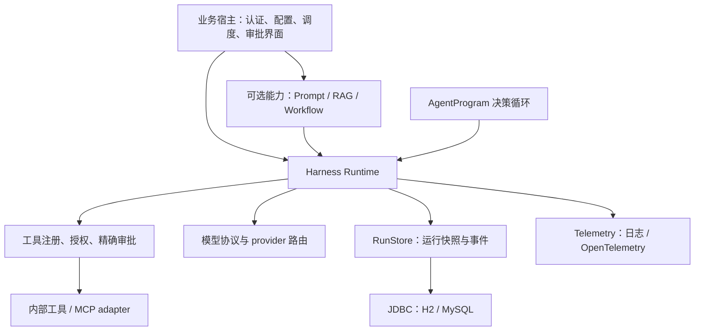

# Harness 架构与运行语义

## 1. 依赖方向

`harness-core` 不依赖其他业务模块。Workflow 是 `Program`，生成 `ModelAction`、`ToolAction`、`WaitAction` 等命令；AgentLoop 也是同一接口的实现。RAG 是正常的工具，Prompt 在创建定义时形成不可变版本/输入快照。任何一个能力都不另建执行账本、审批系统或隐藏的工具重试器。

新 Agent 应复用这些契约，业务对象、资源规则、业务检索和审批界面由宿主提供。将来中台新增共享 worker、管理 API、配置服务与 UI 时仍复用这套运行协议；SDK 不会仅因能力增多就自动变成中台，需要明确服务边界、租户配额与运维责任。

## 2. 单次运行

`start` 固定 actor、ProgramDefinition、模型/Prompt 输入、工具集、预算和总期限。`creationKey` 在 project + subject 范围内幂等；同键不同配置拒绝创建。存储按值复制，返回对象的修改不会影响已保存状态。

一个 `tick` 推进一个有界阶段：领取租约 → 验证状态版本/控制标记 → 由 Program 产生意图或消费结果 → 保存状态与事件。调用分成以下持久边界：

1. **PREPARED**：步骤 ID、请求、契约 hash、审批 digest 已保存，没有发起外部调用。
2. **IN_FLIGHT**：尝试次数和预算已记账，状态与 `ATTEMPT_STARTED` 在同一事务提交；随后在有限线程池发起调用。
3. 已知响应写入 `results`/`receipts`；下一 tick 由 Program 消费。超时或崩溃后无法确认结果的调用标为 **UNKNOWN**。

模型的 provider 原生 `tool_call_id` 用于消息配对。程序本地 action ID 用于消费结果。对外 `ExecutionContext.invocationId` 为 `runId:actionId`，`attemptId` 再加尝试序号；重试保持 invocation 不变，避免不同 Run 复用远端幂等键。

SQL `revision` 防止旧快照覆盖控制操作，`fence` 防止旧 worker 在租约被接管后提交；租约以数据库时钟为准。远端调用位于事务之外。执行线程开始时再次检查租约、暂停/取消、审批有效期、当前授权与同一注册项的契约。暂停或取消已发出的请求无法撤销其远端效果：有响应先保留回执，无响应保留 UNKNOWN 对账入口。

## 3. 审批、权限与未知结果

审批 digest 包含 run、actor、action、节点、工具/输入契约和实际参数。有效期取 30 分钟与剩余运行期限的较小值。`decide` 要求相同项目、有 `approval:decide` 权限和完整预期 digest；与普通运行读取/管理权限分开。禁止过期、重复或错配的审批。执行前还检查当前工具版本和授权。

`AccessPolicy.actorPermissions()` 适合本地/静态授予：支持精确权限与显式 `*`。生产撤权应由宿主实现动态 `AccessPolicy`，每次查询当前权限，不能把持久 actor 权限集合当作完整实时 IAM。run 默认仅允许同项目 owner 使用对应操作；跨 owner 要额外 `run:admin`。`tick`/RunStore 是可信 worker 接口，不是面向终端用户的公开 API。

只读或有明确幂等保证的内部工具可以声明 `retrySafe`，框架对已知暂时失败按次数上限和持久退避执行；`maxAttempts` 是同一 invocation 的总上限，手动 resume 也不重置。UNKNOWN 仅对只读工具自动重试；所有写工具的未知结果都保留对账入口，即使声明幂等也不自动重放，避免后续取消/期限/预算终止掩盖尚未核验的副作用。通用 MCP 写工具强制单次尝试；MCP 本身没有统一远端幂等回执协议。未知模型调用保留用量预留并停止；当前没有模型 UNKNOWN 自动恢复或模型回执对账接口。

`reconcileTool` 接收宿主已经向远端核验的回执，不自行验证业务真伪，也不发起重试。它绑定待对账本地 action ID，提交结果后停在 PAUSED，需显式 resume；此前取消的任务直接 CANCELLED。租约与数据库事务保证账本一致，不能跨任意第三方系统提供 exactly-once 执行。

## 4. 限额、数据与观测

默认预算是 100,000 token、12 次模型、24 次工具、150 步，可由宿主覆盖。每次实际准备 dispatch 都先收费；排队超时/背压可能保守地保留一次计数。模型预留采用请求 UTF-8 字节数、固定余量和最大输出数，属于偏保守的估算，非供应商 tokenizer。已知 usage 按精确报告值结算，未知不归零；报告值可能超过预留，后续调用会被总预算阻断，这不是供应商侧的硬账单上限。

ContextWindow 在请求副本中截短超长工具结果、按完整 assistant/tool 组裁剪旧消息，校验调用配对。完整历史与结果仍存在运行快照中；首版没有长期对话归档、自动摘要或大对象存储。工具 schema 上限为 131,072 Java 字符、参数为 1,048,576 Java 字符、单 run 最多 64 个工具；外部 schema 引用禁止解析。

默认日志输出关联 ID、operation、target、outcome、duration；持久事件提供审批和状态审计。OTel adapter 注入宿主 Tracer，并跨执行池/MCP 异步传递上下文。框架不安装全局 SDK/exporter，默认指标是按 operation/outcome 汇总的本地计数。需要同时输出结构化日志和 OTel 时可由宿主组合 Telemetry。第三方 MCP SDK 的日志设置仍由宿主管理。

运行快照有模型输入、工具结果、Prompt 有效变量、actor 信息，数据库访问、备份和保留期限必须由宿主管理。凭据通过适配器回调注入，不能写入 profile、prompt 或 run definition。

## 5. 首版明确边界

| 项目 | 当前语义 |
|---|---|
| 存储兼容 | SQL schema v1、Run schema v1、runtime `1`；未知版本拒绝，未提供自动迁移 |
| 工作流 | 顺序、条件、人工等待、单次模型、工具和嵌套 Agent；无并行分支/补偿 |
| RAG | 授权范围内词法基线检索、引用与长度控制；外部向量/关键词引擎实现 Retriever |
| 模型 | 显式 provider 路由与冻结 profile；无隐式 fallback、热更新控制台或模型训练部署 |
| 并发 | 每个 Harness 的有限线程池/队列；无跨实例共享限流、熔断器或租户调度公平性 |
| 超时 | 有界等待与线程中断；无法强停忽略中断的本地代码，远端未知效果需对账 |
| 调度 | 宿主调用 tick/tickReady；无自启动 worker、租约续期或 waiting 状态过期清扫任务 |
| 等待过期 | decide 拒绝过期，已排队执行检查期限；未决等待保留供审计，宿主负责清理 |
| MCP | Streamable HTTP、header 凭据、工具白名单；无 stdio 管理、OAuth 编排、自动工具安装 |

先让 OpsAgent 通过业务 adapter 引用 SDK，再用第二个业务验证接口的通用性。只有共享发布配置、租户治理、集中审批/追踪或独立执行资源成为实际需求时，再建设中台服务；不必提前把 SDK 的每一项能力拆成微服务。
