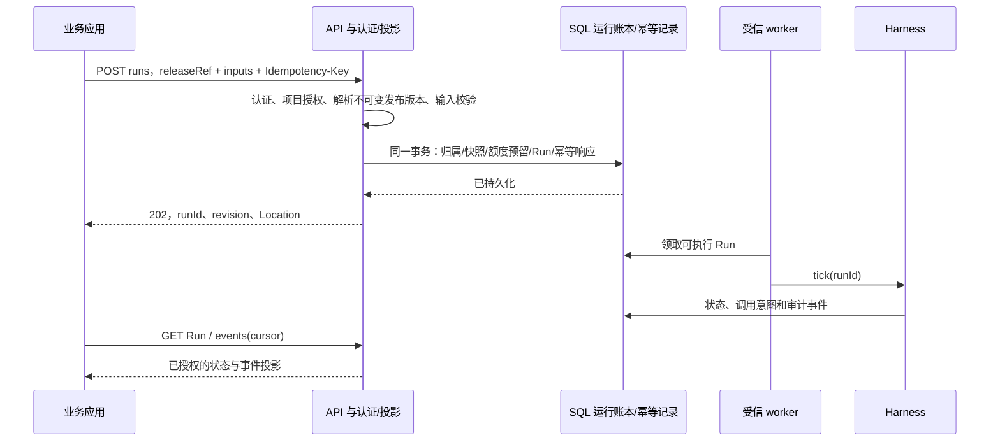

# 阶段 2 执行 API 设计

日期：2026-09-15。版本：`0.1.0-draft.1`。**设计契约，尚未实现 HTTP 服务，也不表示阶段 1 的真实环境联调已通过。**

本轮在启动阶段 1 时，先固定阶段 2 的对外边界和验收要求。机器可读契约见 [OpenAPI 3.1 JSON](api/openapi.json)，验证方法见 [契约验证说明](api/README.md)。设计依据为现有 `Harness`、`RunStore` 及 [建设路线图](agent-platform-roadmap.md)。

## 1. 首个服务只承接执行

平台接收已发布 Agent 的受控输入，持久创建 Run，由独立 worker 推进；HTTP 不执行 AgentLoop，也不等待模型或工具执行完成。阶段 2 可采用一个模块化 Spring Boot 应用和 SQL worker，两者的调用边界保持清晰。



阶段 2 的 release 由部署时校验并装载的不可变 manifest 提供。`agentId + releaseId(UUID) + digest` 必须准确指向本项目的一份已发布版本；停用后禁止新建运行。不得解析 `latest` 或把客户端输入当作内联 Agent/Workflow。已存在 Run 保留原快照，紧急授权撤销仍在每次执行前生效。

资源草稿、目录 CRUD、发布 UI、模型连接管理、知识入库和 Workflow 画布属于阶段 3/4，不在本接口中提前暴露。阶段 2 也不开放 `/tick`、`RunStore.update`、SQL、任意脚本或任意模型/MCP URL。

## 2. 公开资源和入口

统一前缀为 `/v1/projects/{projectId}`，时间采用 UTC RFC 3339。JSON 严格拒绝重复键和请求 DTO 的未知字段；单个请求最多 **65,536 UTF-8 字节、16 层 JSON 嵌套**，发布输入 schema 可进一步收紧。`U+0000` 等控制字符、长文本和输入格式由发布契约按用途约束。

| 方法和路径（省略前缀） | 作用 | 成功 |
|---|---|---|
| `POST /runs` | 使用不可变 releaseRef、inputs 和可选降低上限创建运行 | 202 |
| `GET /runs?cursor=&limit=&status=` | 当前调用方可见的 Run 列表 | 200 |
| `GET /runs/{runId}` | 状态、计数、有效限额和获授权的最终输出 | 200 + ETag |
| `GET /runs/{runId}/events?cursor=&limit=` | 持久事件的允许字段投影 | 200 |
| `POST /runs/{runId}/pause` | 请求在执行边界暂停 | 202 |
| `POST /runs/{runId}/cancel` | 请求取消后续执行，保留已发生/未知效果 | 202 |
| `POST /runs/{runId}/resume` | 恢复满足条件的已暂停或可处理运行 | 202 |
| `GET /runs/{runId}/approval` | 当前工具审批或人工输入请求 | 200 + ETag |
| `POST /runs/{runId}/approvals/{approvalId}/decision` | 对准确审批版本作出决定 | 202 |
| `GET /runs/{runId}/unknown-invocation` | 查询待核验的未知调用 | 200 + ETag |
| `POST /runs/{runId}/tool-reconciliations` | 将已独立核验的工具证据记入账本 | 202 |

所有 POST 都要求 `Idempotency-Key`；除新建 Run 外，还要求 `If-Match`。控制请求体为 `{}`。202 表示命令和幂等结果已经持久提交，不保证后续工具执行成功，也不表示远端效果已经撤销。响应中的最小 `RunCommandView` 只有 id、status、revision、控制标记，不通过审批响应向审批者泄露完整 Run 输出。

202 的 `Location/statusUrl` 指向 Run 查询地址，跟随它仍须具备 `runs:read`。仅有审批权限的人员通过专门审批入口操作，不因命令被接受而获得 Run 数据访问权。`Retry-After` 建议最早查询时间。首版采用短请求轮询，不提供 SSE、模型 token 流或 webhook。

## 3. 身份、项目边界与 DTO

Bearer token 的 issuer、audience、有效期和撤销状态由选定的身份系统验证；平台从可信 token 与授权库得到 **应用身份、有效请求主体、可访问项目、操作权限和资源范围**。机器凭据可以以应用自身为主体；代表用户执行时必须使用可信委托凭据，不能直接相信请求体中的 `userId` 或自报的 `X-User-Id`。

`projectId` 只是资源选择器，必须与已认证授权交集匹配。Actor、permissions、发布快照、执行身份和凭据引用均由服务端构造。公开请求没有模型名、prompt 替换、工具列表、tool policy、endpoint、headers、RunState 或 Actor 字段。发布输入 schema 也禁止把同名业务变量旁路映射成这些控制配置。

| 平台权限（建议名） | 可见范围与作用 | 核心映射 |
|---|---|---|
| `runs:create` | 本应用和主体获授权的 release | `run:create` + 当前工具授权 |
| `runs:read` / `runs:list` | 默认仅当前应用 + 有效主体拥有的 Run | 单次 `run:read`；列表需平台索引 |
| `runs:events:read` | 与 Run 可见性相同，独立授予事件读取 | `run:read` + 平台投影 |
| `runs:control` | 本应用/主体 Run；跨归属需明确 `runs:admin` | `run:control`，必要时 `run:admin` |
| `approvals:read` / `approvals:decide` | 同项目、已分配给当前审批者的审批 | 平台校验分配，决定映射 `approval:decide` |
| `runs:reconcile:read` / `runs:reconcile` | 本归属或明确管理员；还须有证据读取范围 | `run:reconcile`，必要时 `run:admin` |

平台必须保存 project/application/effective-subject 三维归属。当前核心 Actor 只有 project/subject，因此服务端可生成稳定的复合执行主体，并在独立归属表保存原始应用与用户标识；不能把应用 ID 仅放在可修改 labels 中。实时 `AccessPolicy` 从身份和资源授权服务查询有效权限，持久 Actor.permissions 不能代替撤权机制。

跨项目或不可见资源统一返回 404，避免用错误差异枚举存在性；已确认项目可见但缺操作权返回 403。事件、列表、审批、证据、缓存和幂等重放都执行相同归属检查。管理员不是默认全组织管理员，只在显式授予的项目内生效。

公开响应专门投影：

- Run 不返回 memory、messages、模型请求、tool schema/原始参数、receipts、完整 definition、credential reference、lease/fence 或内部异常。
- output 必须满足 release 的输出投影与当前 ACL；未授权时 `OMITTED/REDACTED`，只有 `AVAILABLE` 可带 value。大输出使用发布时定义的受控结果引用或省略，不能返回损坏的截断 JSON。
- 事件映射为 OpenAPI 中的允许类型，只返回 sequence、at、status、受控 reasonCode 和 invocationRef 等字段。不能直接序列化核心事件 attributes。
- 审批摘要通过独立 review grant 返回必要目标和参数。关键信息被遮挡时 `reviewComplete=false`，禁止批准，仍可拒绝。工具内容和人工提示均作为不可信纯文本显示。
- 响应和错误带服务端 requestId；认证头、原始输入、凭据和完整响应不进入默认访问日志。响应使用 `Cache-Control: no-store`。

## 4. 幂等和并发条件

### 幂等记录

所有 POST 的作用域为：`project + application + effectiveSubject + HTTP method + canonical route + Idempotency-Key`。route 包含实际 run/approval ID；不能只用 run ID 或全局 key。相同键与规范化请求体摘要返回首次接受的响应；同键不同语义请求为 409。JSON 对象键顺序不影响摘要，未知字段和重复键在计算摘要前被拒绝。

记录至少包含归属、请求摘要、接受时间、关联 Run、HTTP 响应及过期/保留状态。创建时的默认限额、release 快照、deadline 和输入只解析一次并与幂等记录一同提交。重试不按当前 release 重建、不延长 deadline、不刷新已接受 Run 的预算。

顺序为：认证和当前访问授权 → 请求语法/摘要 → 已存在幂等结果 → 新请求的 If-Match/业务前置条件 → 同一事务写状态、事件和幂等响应。重放不绕过撤权；但已成功接受的重放不重新应用已过期的 If-Match，否则客户端丢失响应后无法恢复已接受结果。If-Match 不进入语义请求体摘要，携带新 If-Match 的同键同体仍只重放首次结果，不执行第二次。

并发同键用唯一约束和事务解决。执行中的同键可短暂等待首次事务，或返回 `409 IDEMPOTENCY_IN_PROGRESS` 和 Retry-After；不得并行生成两个 Run。任何不确定提交、网关超时或 503 后，客户端只能用**原键、原请求体**重试；不能因没收到 runId 而换键。

建议保留完整幂等响应至 Run 终止后 30 天；删除正文后，保留已使用 key 的不可逆摘要墓碑，至少覆盖调用方约定的最大重试窗口，并在 API 服务存续期间禁止同作用域已使用 key 重新创建执行。受项目删除策略约束的墓碑清理必须同时撤销该项目命名空间，不能让旧请求在新项目下复活。清理后的重放返回明确冲突/已归档错误，不能默默当新请求。具体保留时长由阶段 2 部署的数据保留策略确认，不把“24 小时幂等”当作无限安全重试。

### 原子并发条件

Run revision 以十进制**字符串**返回，避免 Java long 经 JavaScript 精度丢失。读取 Run/审批/UNKNOWN 返回同一运行并发基线的强 ETag；其 opaque token 绑定 project、run、revision、调用权限/投影范围以及该响应的投影摘要，不能由客户端直接拼 revision 伪造。不同读取视图的 ETag 可以不同，但指向同一 Run revision。派生审批过期状态、权限或投影变化也必须改变对应读取视图的 ETag，不能只用数据库 revision 充当 HTTP 表示的强校验值。这里的 `If-Match` 明确定义为命令所操作的 **Run 并发条件**，而非审批 digest 的替代物；服务同时校验该 token 绑定的读取视图、授权和业务前置条件。

缺少 If-Match 返回 428；格式不正确、`*` 或多个 ETag 返回 400；旧 revision、失效范围或 token 不匹配返回 412。worker 领取、调用记账和状态写入也可能改变 revision，因此冲突是正常结果。客户端重新读取、重新审视状态后，若仍希望发出一条新命令，再使用新键、新 ETag；不能对新状态自动盲重试人工决定。

**现有代码存在必须补齐的差距：**`Harness.pause/cancel/resume/decide/reconcileTool` 会在方法内部读取 current.revision，并没有调用方 expectedRevision 参数。服务层先检查 ETag 再调用当前方法，会留下 TOCTOU 竞争窗口，无法实现这个契约。阶段 2 必须增加经过测试的 expectedRevision 控制重载或等价的核心命令事务接口，校验、状态变更、审计、幂等响应在同一个 SQL 事务内提交；不能由 HTTP 层复制状态机写字段来规避。

## 5. 审批与未知结果语义

审批操作同时绑定 `approvalId + digest + If-Match`。approvalId 由平台为 run/local invocation/digest 的准确审批实例稳定生成；不接受客户端自行创建。公开 digest 采用 `sha256:<64 位小写十六进制>`，核心 `Json.hash` 当前只返回 64 位十六进制；服务 DTO 映射时添加算法前缀，调用核心决定方法前校验算法和格式并剥离前缀。摘要内容必须对应核心审批绑定，不由 UI 用脱敏字段重新计算。

批准前重新检查当前授权、分配规则、reviewComplete、摘要、当前 pending、控制标记和期限；过期/已消费/状态不适配返回 409。审批读取可以派生 `EXPIRED`，即使等待清扫尚未写回账本，也不能继续批准。批准 HUMAN_INPUT 时必须提交 input，按发布节点契约验证且保持字面字符串；TOOL 审批及拒绝操作不接受 input。`reason` 是独立审计理由，不能复用当前 core Approval.reason 作为 input 后又覆盖它。核心目前把这两个语义混在一个字段，平台需要保留单独审计记录。

| 情况 | API/worker 的处理 |
|---|---|
| 尚未 dispatch 的暂停/取消 | 在原子条件下记录意图，在安全边界停止 |
| 已 dispatch 且收到响应 | 保留真实结果/回执，再处理暂停/取消 |
| 已 dispatch 后断连或 worker 丢失，写结果不明 | NEEDS_ATTENTION + UNKNOWN；不因取消或到期而隐藏 |
| UNKNOWN 工具对账 | 只记入已核验结果；成功后 PAUSED，已有取消则 CANCELLED |
| UNKNOWN 模型 | 保留用量预留，供操作员处理；v1 没有伪装成工具的对账入口 |
| resume | 不允许 UNKNOWN/仍 IN_FLIGHT，不重置预算、期限或尝试次数 |
| COMPLETED/FAILED/CANCELLED/EXPIRED/BUDGET_EXCEEDED | v1 视为终态，控制命令 409；如需重新运行，明确创建新 Run |

对账不是“人工说成功”。请求只提交 `evidenceRef + invocationRef + invocationDigest + reason`。evidenceRef 必须在本项目受信证据存储中存在；由独立、只读的对账器或授权操作员流程先核验远端结果，记录 verifier、时间、来源、remote receipt、结果与 exact invocation/contract/arguments 绑定。HTTP 不能接受任意 URL、ToolResult、success 布尔值或手工伪造的远端响应。

阶段 2 初期可由受信管理任务导入不可变证据，不需要先做完整证据管理 UI；证据导入与验证权限和普通 Agent 执行权限分开。调用此 API 时只读取已验证证据，在同一 CAS 事务中记录结果，**不发起远端写入，也不先重跑工具来确认**。无法证明结果时保持 UNKNOWN。MODEL、错项目、错 invocation、错目标/参数或未验证证据均拒绝。

数据库 lease/CAS 和幂等键只能保证平台账本不重复接受同一命令，不能对所有外部工具承诺 exactly-once。MCP 协议不提供通用业务回执或写幂等保证。

## 6. 列表、游标和错误

列表使用 `(createdAt DESC, id DESC)` 的 keyset 游标，首请求固定创建时间水位，后续新 Run 不插入该次分页。status 过滤必须随请求保持相同；运行状态会变化，所以列表是读取时的视图，不承诺跨页状态快照。cursor 绑定项目、应用、主体、过滤条件和授权范围，并有签名和失效时间；权限撤销后重新验证，不能用旧 cursor 保留访问。

事件按单 Run 内部 sequence 升序扫描，但只有允许公开的事件进入响应。`nextCursor` 始终存在，推进至最后扫描的内部事件，**空页也要保存**；`hasMore=false` 后继续按 Retry-After/客户端退避轮询。首请求缺 cursor 从最早可用历史开始，若所需历史已经被删除返回 410；不能悄悄从最新事件开始。客户端按 runId + sequence 去重。未提供审计归档下载时，需要审计完整历史的用户由受控运维流程读取归档。

| 状态码 | 典型错误码 | 客户端行为 |
|---|---|---|
| 400 / 413 / 415 / 422 | INVALID_REQUEST / PAYLOAD_TOO_LARGE / UNSUPPORTED_MEDIA_TYPE / INPUT_INVALID | 修正输入；不得把无效请求直接交给 worker |
| 401 / 403 / 404 | UNAUTHENTICATED / FORBIDDEN / NOT_FOUND | 更新可信凭据或获取正确授权；不泄露资源存在性 |
| 409 | IDEMPOTENCY_CONFLICT / INVALID_STATE / OUTCOME_UNKNOWN / APPROVAL_STALE / EVIDENCE_MISMATCH | 查询状态和业务核验；不能自动重试未知写 |
| 410 | CURSOR_EXPIRED | 重新列表/查询当前状态，或走受控审计归档流程 |
| 412 / 428 | PRECONDITION_FAILED / PRECONDITION_REQUIRED | 重新读取 ETag，审视状态，再决定是否产生新命令 |
| 429 | QUOTA_EXCEEDED | 按 Retry-After 退避；同键请求在未接受前可继续尝试 |
| 503 / 5xx | TEMPORARILY_UNAVAILABLE / INTERNAL_ERROR | POST 只允许同键同体恢复接受结果，GET 可退避重试 |

Error 统一为 `{error:{code,message,requestId,retryDisposition,details?}}`，details 只有字段名与固定校验码，没有用户输入回显。`retryDisposition` 约束 API 请求恢复，不授权重跑模型或工具。`SAME_KEY_ONLY` 在 POST 上要求原键原体；用于共享错误响应的 GET 则按 `READ_AFTER_DELAY` 理解，无需为读取生成幂等键。OpenAPI 的 default error 用于未预期 HTTP 失败；服务实现不得把未处理异常消息直接写入 message。

## 7. 实施差距与建议顺序

| 当前 Harness 已有 | 阶段 2 要补齐 | 验收证据 |
|---|---|---|
| 单 Run 状态、事件、SQL CAS/租约 | API 宿主、可信认证、三维归属索引、DTO 投影 | 两应用/两主体/两项目的越权测试；所有入口和重放均覆盖 |
| project + subject + creationKey 幂等创建 | 应用维度、所有命令幂等、响应账本和事务整合 | 并发同键、丢响应、断提交、同键不同体不产生重复执行 |
| 内部读取 revision 的控制方法 | 调用方 expectedRevision 的原子控制语义 | worker/控制并发竞争，旧 ETag 一律 412 且无变更 |
| Agent/模型/工具/Prompt/Workflow 快照 | 部署 manifest 的 immutable release、输入/output/review schema | 发布变化不影响旧 Run，客户端不能改变工具授权或 endpoint |
| core 同项目 owner/admin 基线 | 服务端动态权限、审批任务分配、脱敏投影 | owner 不能自动批准，审批者不能自动读完整 Run 输出 |
| tick/tickReady、store.ready | worker 调度、等待到期处理、优雅停机、租约回收 | API/worker 重启；审批到期；UNKNOWN 不被清理掩盖 |
| 本机线程池、单 Run 预算 | 项目/应用排队、共享额度预留、后端并发限制 | 两实例试点不超配额，429 不创建半个 Run |
| 工具 reconcileTool 接收可信结果 | 独立证据记录、核验器、绑定检查、命令审计 | 错 receipt/项目/目标/参数/模型未知调用均拒绝 |
| RunStore.get/events/ready | 带授权索引的 Run list + 签名游标 + 事件投影映射 | keyset 页无重复、跨项目 cursor 不可用、过期历史 410 |
| stop 状态和控制标记 | HTTP 终态统一校验，尤其 BUDGET_EXCEEDED | core 已补齐 BUDGET_EXCEEDED 的 pause/cancel 终态保护及回归；HTTP 服务仍需按统一状态表映射 409 |

实施建议按三批进行：

1. **API 与数据事务底座：**发布 manifest、身份/归属、创建/查询/列表/事件、幂等和 expectedRevision；使用合成工具跑通故障测试。
2. **治理操作和 worker：**暂停/取消/恢复、审批、独立证据对账、期限清扫、共享最小额度、可靠领取和停机。
3. **内部试点验收：**使用阶段 1 验证过的模型/MCP/MySQL 和两类场景，进行跨项目、撤权、UNKNOWN、重启和回退验收，再开放给首批调用方。

这些是阶段 2 的实施要求，不是当前文档对外宣称已有的能力。当前阶段 1 真实联调所得的协议差异可以修改草案；服务首次对外试用前冻结 `v1`，使用契约测试阻止破坏式改动。

## 8. HTTP 调用示例（仅示意，无运行端点）

```http
POST /v1/projects/ops-dev/runs HTTP/1.1
Authorization: Bearer <trusted-access-token>
Content-Type: application/json
Idempotency-Key: 4df49e2e-cc5a-47be-8a51-6242abc526a0

{
  "releaseRef": {
    "agentId": "ops-readonly",
    "releaseId": "bc2d667e-dfd8-4c09-9a38-c083344a5da7",
    "digest": "sha256:aaaaaaaaaaaaaaaaaaaaaaaaaaaaaaaaaaaaaaaaaaaaaaaaaaaaaaaaaaaaaaaa"
  },
  "inputs": {"question": "查询沙箱服务的状态"},
  "limits": {"maxTokens": 20000, "lifetimeSeconds": 600},
  "clientReference": "sandbox-check-20260915-01"
}
```

先 GET Run 得到 ETag，再发控制命令。审批需先 GET 审批取得同一 revision 基线的 ETag、approvalId 与完整 digest；以下 token 仅是格式示例，不能提交到真实服务。

```http
POST /v1/projects/ops-dev/runs/51cf0f17-0d6a-4d04-bafb-417d558027f2/pause HTTP/1.1
Authorization: Bearer <trusted-access-token>
Content-Type: application/json
Idempotency-Key: be0248ec-2005-4b1f-895f-51f3a9c1f80a
If-Match: "r1.b3BhcXVlX3J1bl9yZXZpc2lvbl90b2tlbg"

{}
```

审批和工具证据对账的完整请求/响应例子已经嵌入 OpenAPI；API 文档渲染器可直接展示。它们使用 `.invalid` 服务地址、合成问题与沙箱操作，不包含现有 OpsAgent 的真实凭据或业务数据。
